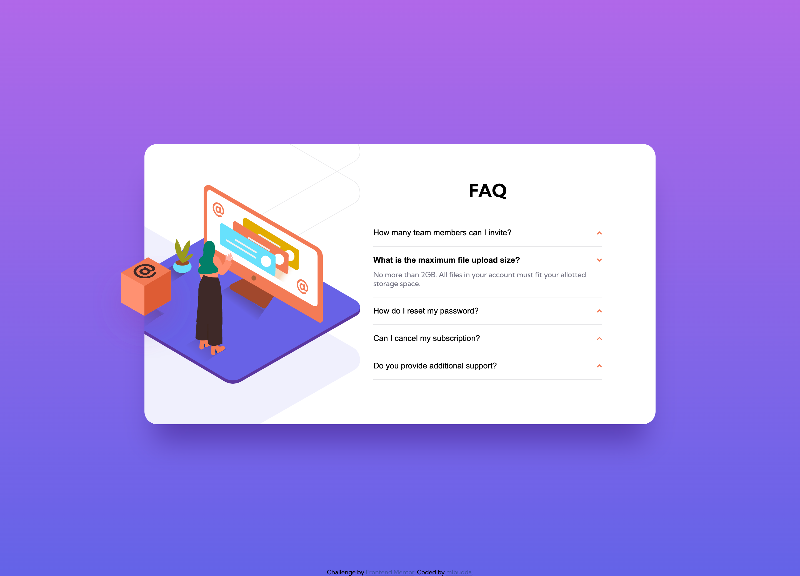

# Frontend Mentor - FAQ accordion card solution

This is a solution to the [FAQ accordion card challenge on Frontend Mentor](https://www.frontendmentor.io/challenges/faq-accordion-card-XlyjD0Oam). Frontend Mentor challenges help you improve your coding skills by building realistic projects.

## Table of contents

- [Overview](#overview)
  - [The challenge](#the-challenge)
  - [Screenshot](#screenshot)
  - [Links](#links)
- [My process](#my-process)
  - [Built with](#built-with)
  - [What I learned](#what-i-learned)

## Overview

### The challenge

Users should be able to:

- View the optimal layout for the component depending on their device's screen size
- See hover states for all interactive elements on the page
- Hide/Show the answer to a question when the question is clicked

### Screenshot

### Links

- Solution URL: [Solution URL here](https://github.com/mlbudda/portfolio/tree/master/faq-accordion-card-main)
- Live Site URL: [Add live site URL here](https://mlbudda.github.io/portfolio/faq-accordion-card-main/)

## My process

### Built with

- Semantic HTML5 markup
- CSS custom properties
- Flexbox
- JavaScript

### What I learned

This project was simple and yet tricky enough to underestimate the time to complete. The design looks simple, but it has overflow and layers of the 3 background images. Everything has to keep centered positions and align with the text on the right.

## Author

- Frontend Mentor - [@mlbudda](https://www.frontendmentor.io/profile/mlbudda)
