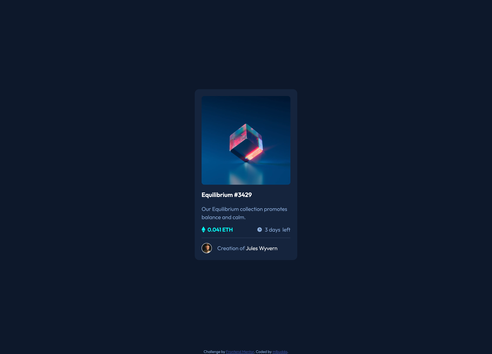

# Frontend Mentor - NFT preview card component solution

This is a solution to the [NFT preview card component challenge on Frontend Mentor](https://www.frontendmentor.io/challenges/nft-preview-card-component-SbdUL_w0U). Frontend Mentor challenges help you improve your coding skills by building realistic projects.

## Table of contents

- [Overview](#overview)
  - [The challenge](#the-challenge)
  - [Screenshot](#screenshot)
  - [Links](#links)
- [My process](#my-process)
  - [Built with](#built-with)
  - [What I learned](#what-i-learned)
- [Author](#author)

## Overview

### The challenge

Users should be able to:

- View the optimal layout depending on their device's screen size
- See hover states for interactive elements

### Screenshot

### Links

- Solution URL: [Solution URL here](https://github.com/mlbudda/portfolio/tree/master/nft-preview-card-component-main)
- Live Site URL: [Live site URL here](https://mlbudda.github.io/portfolio/nft-preview-card-component-main/)

## My process

### Built with

- Semantic HTML5 markup
- CSS custom properties
- CSS min()
- Responsive paddings/margins
- Flexbox

### What I learned

During this challenge, I focused on responsive layout, margins, and paddings. My biggest issue was adding two layers on top of an image on the hover pseudo-class.
I solved this issue by using absolute positioning. This allowed me to layer the image and keep it responsive on any screen size. I also added a slight transition effect to make the design more visually appealing. Finally, I adjusted the margins and paddings to ensure that the design was aesthetically pleasing and that it displayed correctly on all devices.

## Author

- Frontend Mentor - [@mlbudda](https://www.frontendmentor.io/profile/mlbudda)
